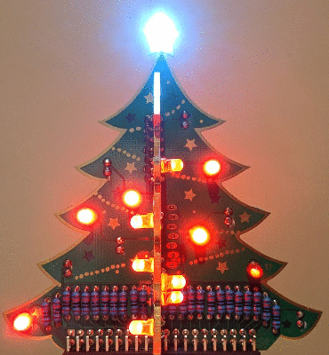

# 3dxmas

> Nodejs application to control The PiHiut [3D Xmas Tree for Raspberry Pi](https://thepihut.com/products/3d-xmas-tree-for-raspberry-pi)



## Install

The deb package is built for Raspbian.  To install download the latest deb package on the Raspberry Pi and install

```
sudo apt-get install nodejs node-legacy
sudo dpkg -i 3dxmas*.deb
```

## Uninstall

```
sudo dpkg --remove 3dxmas
```

## Building From Source

```
git clone https://github.com/martinbark/3dxmas.git
cd 3dxmas
npm install
./3dxmas
```

## License

See the [LICENSE](LICENSE) file for license rights and limitations (MIT).
